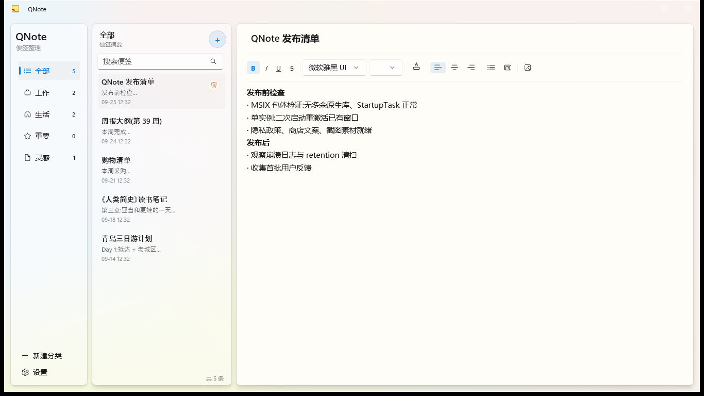
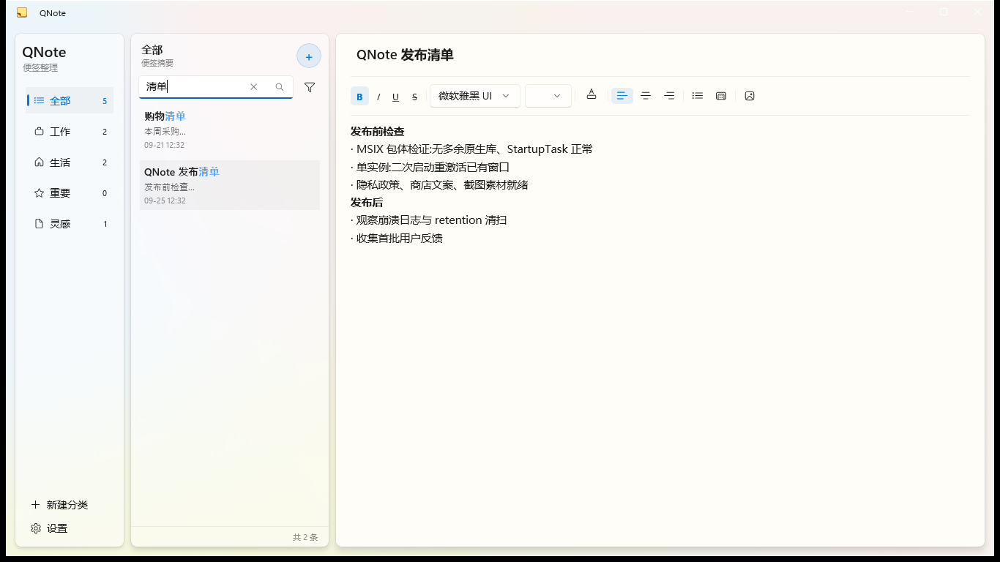
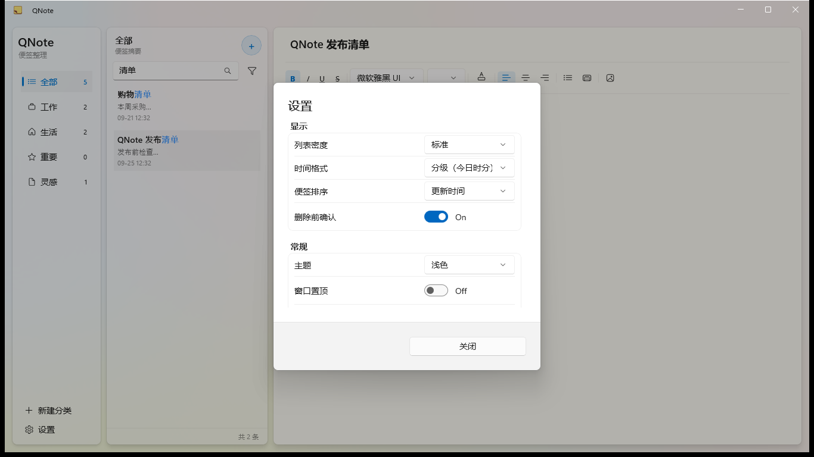
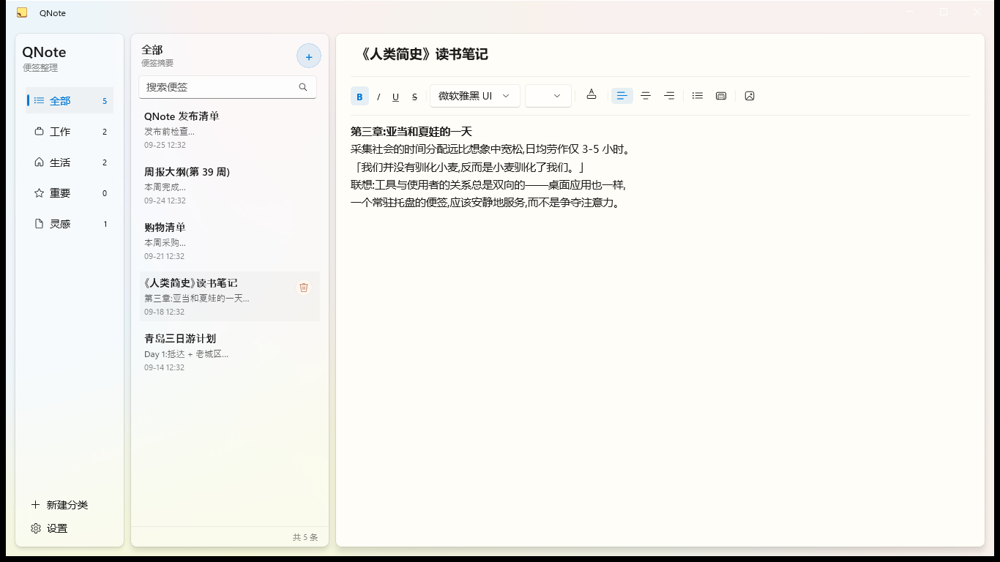

# QNote

[](https://github.com/Mr-Second/QNote/actions/workflows/ci.yml)
[](https://github.com/Mr-Second/QNote/actions/workflows/release.yml)

A lightweight sticky-note app for Windows, built with **WinUI 3**.

QNote is a from-scratch C# / WinUI 3 rewrite of an earlier Qt/QML
implementation, with one north star: **low memory footprint**. It idles at
roughly **45–50 MB** of RAM where the Qt build consumed ~250 MB — lean enough
to keep running all day without thinking about it.

## Screenshots

| | |
|---|---|
|  |  |
|  |  |

## Features

- **Notes CRUD** with an RTF rich-text editor and a formatting toolbar
  (bold / italic / lists / colors / …)
- **Instant search** powered by SQLite FTS5, with keyword highlighting
- **Categories** in the sidebar, drag-to-reorder
- **Image insertion** in notes; double-click opens the system image viewer
- **Backup & restore** — `.qns` archives (ZIP + AES-256 encrypted) with three
  restore modes
- **Top-edge auto-hide** — dock notes to the screen edge; plus a global hotkey
- **System tray** with close-to-tray and launch-at-startup
- **Settings panel** — theme, sort order, density, always-on-top,
  remember window position
- **Crash dumps + rolling logs** for diagnostics

## Install

Two channels, same app:

- **Microsoft Store** (recommended — one-click install, auto-updates,
  Microsoft-trusted signing): [QNote on Microsoft Store](https://apps.microsoft.com/detail/9NV57VJPTPCZ)
- **Portable zip** (green software — runs from any folder, data travels with
  it) from [Releases](https://github.com/Mr-Second/QNote/releases):
  `QNote_<version>_win-x64_native-aot.zip` — NativeAOT-compiled: small
  download, fast startup, zero dependencies

Unzip anywhere writable and run `QNote.exe`. All data (notes DB, images,
logs) lives in a `data\` folder next to the exe — copy the folder to migrate.
Portable zips are not code-signed; verify downloads against the
`SHA256SUMS.txt` published with each release (see
[docs/code-signing-policy.md](docs/code-signing-policy.md)).

Store and portable installs are independent — both can coexist on one machine.

**Requirements:** Windows 10 19041+ / Windows 11, x64.

## Build from source

Requires **.NET 10 SDK** on Windows.

```powershell
# Build
dotnet build QNote.slnx -c Debug

# Run the app
dotnet run --project src/QNote/QNote.csproj -c Debug

# Run tests (Core layer, headless)
dotnet test tests/QNote.Tests/QNote.Tests.csproj -c Debug
```

## Tech stack

| Concern | Choice |
|---|---|
| UI | WinUI 3 / Windows App SDK 2.3.1, XAML with `x:Bind` |
| Runtime | .NET 10 |
| MVVM | CommunityToolkit.Mvvm |
| Data | SQLite via Microsoft.Data.Sqlite, FTS5 full-text search |
| Tests | xUnit |
| Distribution | Microsoft Store (MSIX) + portable zips (GitHub Releases) |

## License

[MIT](LICENSE)
